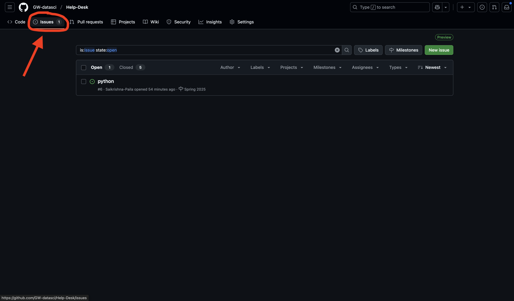
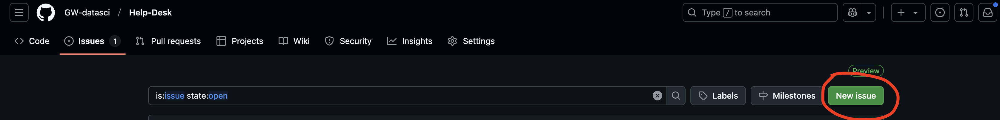
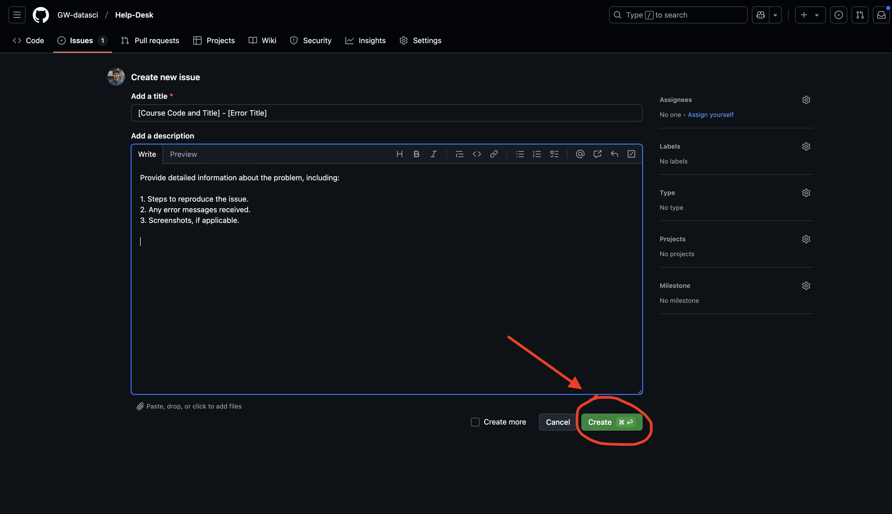

# 🎓 GW Data Science Help Desk

Welcome to the George Washington University **Data Science Help Desk**!  
We are dedicated to supporting Data Science students by resolving technical challenges and ensuring a smooth academic experience.

---

## 🛠️ Services We Offer

We provide assistance in the following areas:

### 💻 Software Installation & Environment Setup
- Guidance on installing tools like Anaconda, Python, R, RStudio, VS Code, and Jupyter Notebook.
- Help with setting up virtual environments and resolving compatibility issues across operating systems.

### 📦 Package & Dependency Troubleshooting
- Assistance with errors related to package installations using `pip`, `conda`, or CRAN.
- Support for handling version conflicts and fixing broken environments.

### 👨‍💻 Coding & IDE Support
- Debugging syntax, runtime, and logic errors in Python, R, and SQL.
- Help configuring and troubleshooting IDEs like Jupyter Notebook, VS Code, PyCharm, and RStudio.

### 🔀 Version Control
- Guidance on using Git and GitHub effectively.
- Support for resolving version control-related issues.

### ⚙️ System Performance & Network Connectivity
- Assistance with performance issues, including GPU usage.
- Help resolving network-related errors affecting installations or remote connections.

> 🚫 **Note:** We do *not* provide help with homework or direct assignment solutions. Our goal is to support your technical growth and problem-solving skills.

---

## 📝 How to Submit a Support Request (GitHub Issue)

Follow the steps below to create a new issue in the Help Desk GitHub repository:

### 1. Navigate to the Repository
- Join the **GW Data Science Program GitHub organization**.
- Open the `Help-Desk` repository (pinned on the organization’s main page).

### 2. Access the Issues Tab
- Click on the **"Issues"** tab at the top of the repository.  
  

### 3. Create a New Issue
- Click on the **"New Issue"** button.  
  

### 4. Add Details and Submit
- **Title Format:**  
  `[Course Code and Title] - [Brief Description]`  
  _Example: `DATS 6101 - Python: Unable to import pandas after installation`_

- **Description Guidelines:**
  - Steps to reproduce the issue
  - Full error message(s)
  - Your OS and environment setup (Windows, Mac, Linux; Python version, etc.)
  - Screenshots (if applicable)

- Once done, click **“Submit new issue”**.  
  

---

## 🚀 What Happens Next?

After submitting your issue:
- Our technical support specialists will review your request.
- We’ll respond as soon as possible with troubleshooting steps or follow-up questions.
- You’ll be notified through GitHub when there’s a response or resolution.

---

## 📆 Book a Help Desk Appointment

Need personalized support? You can schedule a one-on-one session with a Help Desk specialist to get help with technical issues related to your coursework, tools, or environment setup.

Use the link below to choose a convenient time slot:

| [📅 Book an Appointment](https://calendar.app.google/qK6fFQLxZuuV78S79) |
|:------------------------------------------------------------------------:|

> During booking, please include a brief description of the issue or topic you’d like to discuss (e.g., Python environment setup, Jupyter not launching, GitHub error).  

Thank you for using the **GW Data Science Help Desk**!  
We’re here to support your learning journey — technically and efficiently.
