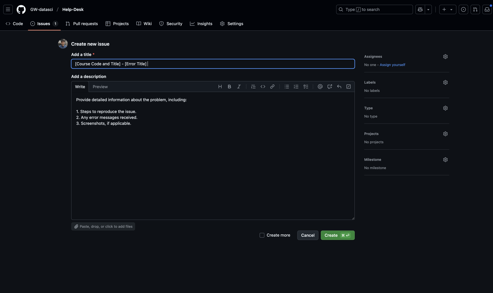

# 🎓 GW Data Science Help Desk

Welcome to the George Washington University Data Science Help Desk! We are dedicated to assisting Data Science students with technical challenges to enhance their academic experience.

## 🛠️ Our Services

We offer support in the following areas:

- **💻 Software Installation & Environment Setup**
  - Guidance on installing tools like Anaconda, Python, R, RStudio, VS Code, and Jupyter Notebook.
  - Assistance with setting up virtual environments and resolving compatibility issues across different operating systems.

- **📦 Package & Dependency Troubleshooting**
  - Help with resolving errors related to package installations using `pip`, `conda`, or CRAN.
  - Assistance in managing version conflicts and broken environments.

- **👨‍💻 Coding & Integrated Development Environment (IDE) Support**
  - Debugging syntax, runtime, and logic errors in languages such as Python, R, and SQL.
  - Support for configuring and troubleshooting IDEs like Jupyter Notebook, VS Code, PyCharm, and RStudio.

- **🔀 Version Control**
  - Guidance on using Git and GitHub for version control, including resolving common issues.

- **⚙️ System Performance & Network Connectivity**
  - Assistance with hardware-related issues, including GPU concerns.
  - Troubleshooting network-related problems affecting software installations or remote access.

> **🚫 Note:** We do not provide assistance with homework or direct assignment solutions. Our goal is to help you overcome technical obstacles and enhance your problem-solving skills.

---

## 📝 How to Create an Issue

To seek assistance, please follow these steps to create an issue in our GitHub repository:

1. **Navigate to the Repository**
   - After joining the **GW Data Science Program** GitHub organization,
   - You can find the `Help-Desk` repository pinned on the main organization page.
   - Click on the pinned `Help-Desk` repo to open it.

2. **Access the Issues Tab**
   - Click on the 'Issues' tab located at the top of the repository page.

   **

3. **Initiate a New Issue**
   - Click on the 'New Issue' button.

   **

4. **Add a Clear Title and Detailed Description**
   - In the **Title** field, enter a concise summary of your issue using the format:  
     `[Course Code and Title] - [Error Title]`  
     *Example: `DATS 6101 - Python: Unable to import pandas after installation`*

   - In the **Description** field, provide detailed information about the issue, including:
     - Steps to reproduce the problem.
     - Any error messages received.
     - Your operating system, tools used, and environment setup.
     - Screenshots, if applicable.

   **

5. **Submit the Issue**
   - Click 'Submit new issue' to post your query.

   **

---

## 🚀 After Submitting an Issue

Once you submit an issue, our technical specialists will promptly review it and work diligently to resolve your problem as soon as possible.

Thank you for using the GW Data Science Help Desk! We’re here to support your learning journey — technically and efficiently.
