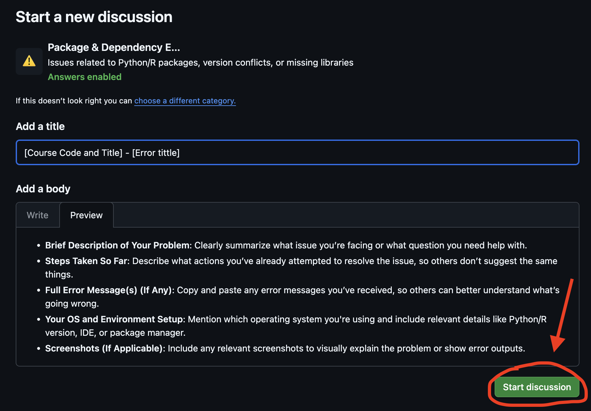
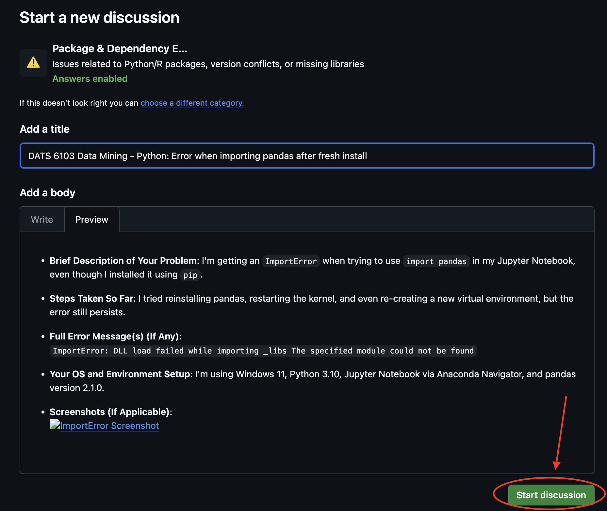

# 🎓 GW Data Science Help Desk

Welcome to the George Washington University **Data Science Help Desk**!  
We are dedicated to supporting Data Science students by resolving technical challenges and ensuring a smooth academic experience.

---

## 🛠️ Services We Offer

We provide assistance in the following areas:

### 💻 Software Installation & Environment Setup
- Guidance on installing tools like Anaconda, Python, R, RStudio, VS Code, and Jupyter Notebook.
- Help with setting up virtual environments and resolving compatibility issues across operating systems.

### 📦 Package & Dependency Troubleshooting
- Assistance with errors related to package installations using `pip`, `conda`, or CRAN.
- Support for handling version conflicts and fixing broken environments.

### 👨‍💻 Coding & IDE Support
- Debugging syntax, runtime, and logic errors in Python, R, and SQL.
- Help configuring and troubleshooting IDEs like Jupyter Notebook, VS Code, PyCharm, and RStudio.

### ⚐️ Version Control
- Guidance on using Git and GitHub effectively.
- Support for resolving version control-related issues.

### ⚙️ System Performance & Network Connectivity
- Assistance with performance issues, including GPU usage.
- Help resolving network-related errors affecting installations or remote connections.

> 🚫 **Note:** We do *not* provide help with homework or direct assignment solutions. Our goal is to support your technical growth and problem-solving skills.

---

## 💬 How to Start a Discussion (GitHub)

Follow these steps to post your question or technical issue using GitHub Discussions.

### 1. Navigate to the Discussions Tab  
- Go to the `Help-Desk` repository under the **GW-datasci** GitHub organization.
- Click on the **"Discussions"** tab.  
  

---

### 2. Click on “New Discussion” 
- Press the green **"New discussion"** button on the top right.  
  

---

### 3. Select a Category  
- Choose the category that best matches your question (e.g., Coding & IDE Issues, Package & Dependency Errors, Software Installation & Environment Setup)

---

### 4. Use the Discussion Template  
Use the format below when filling out the discussion body for clarity and completeness:  


**Title Format:**  
`[Course Code and Title] - [Brief Description]`

```markdown
- **Brief Description of Your Problem**: Clearly summarize what issue you’re facing or what question you need help with.
- **Steps Taken So Far**: Describe what actions you’ve already attempted to resolve the issue, so others don’t suggest the same things.
- **Full Error Message(s) (If Any)**: Copy and paste any error messages you’ve received, so others can better understand what’s going wrong.
- **Your OS and Environment Setup**: Mention which operating system you're using and include relevant details like Python/R version, IDE, or package manager.
- **Screenshots (If Applicable)**: Include any relevant screenshots to visually explain the problem or show error outputs.
```

---

### 5. Example Discussion  
Here’s an example of a well-formatted discussion post:



After completing the title and body, click the **“Start discussion”** button to submit your post.

### 6. View Your Discussion Post  
After submission, your post will be visible under the selected discussion category — like the example shown below.

---

## 🚀 What Happens Next?

After posting your discussion:
- Our technical support team will review your question.
- You'll receive a response shortly with troubleshooting tips or follow-up questions.
- You'll be notified through GitHub when your post receives a reply or is resolved.

---

## 🗖️ Book a Help Desk Appointment

Need personalized support? You can schedule a one-on-one session with a Help Desk specialist to get help with technical issues related to your coursework, tools, or environment setup.

Use the link below to choose a convenient time slot:

| [🗓️ Book an Appointment](https://calendar.app.google/qK6fFQLxZuuV78S79) |
|:------------------------------------------------------------------------:|

> During booking, please include a brief description of the issue or topic you’d like to discuss (e.g., Python environment setup, Jupyter not launching, GitHub error).

---

Thank you for using the **GW Data Science Help Desk**!  
